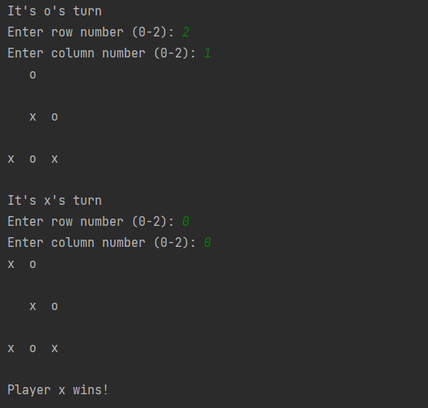

## Documentation / Dokumentacja

<ul class="nav nav-tabs" id="myTab" role="tablist">
  <li class="nav-item">
    <a class="nav-link active" id="english-tab" data-toggle="tab" href="#english" role="tab" aria-controls="english" aria-selected="true">English Version</a>
  </li>
  <li class="nav-item">
    <a class="nav-link" id="polish-tab" data-toggle="tab" href="#polish" role="tab" aria-controls="polish" aria-selected="false">Polish Version</a>
  </li>
</ul>

  
  
  
# Tic Tac Toe Game

## Description
Tic Tac Toe is a popular two-player game in which players take turns placing their symbols (X or O) on a 3x3 board. The game ends when one player places their symbols in a single line (horizontal, vertical, or diagonal) or when the board is filled without a winner.

## Running the Game
The game is run using the main.py file. Upon running, the player will be prompted to enter the names of player 1 and player 2. The game starts with player 1.

## How to Play
Players take turns placing their symbols on the board by entering the appropriate row and column coordinates. The game ends when one player places their symbols in a single line (horizontal, vertical, or diagonal) or when the board is filled without a winner.

## Functions
The following functions are used in the game:

- `draw_board(board)` - draws the board
- `is_board_full(board)` - checks if the board is full
- `is_cell_empty(board, x, y)` - checks if the cell is empty
- `is_winner(board, player)` - checks if the player won
- `make_move(board, x, y, player)` - makes a move for the player
- `change_player(player)` - changes the player

## Author
The game was created by Marcel Nędza
  

  

# Gra w kółko i krzyżyk

## Opis
Gra w kółko i krzyżyk to popularna gra dla dwóch graczy, w której gracze na przemian umieszczają swoje symbole (kółko lub krzyżyk) na planszy o wymiarach 3x3. Gra kończy się, gdy jeden z graczy umieści swoje symbole w jednej linii (poziomej, pionowej lub przekątnej) lub gdy plansza zostanie wypełniona bez zwycięzcy.

## Uruchamianie gry
Gra jest uruchamiana za pomocą pliku main.py. Po uruchomieniu, gracz zostanie poproszony o wprowadzenie imienia gracza 1 i gracza 2. Gra rozpoczyna się od gracza 1.

## Instrukcja gry
Gracze na przemian umieszczają swoje symbole na planszy, wprowadzając odpowiednie koordynaty dla wiersza i kolumny. Gra kończy się, gdy jeden z graczy umieści swoje symbole w jednej linii (poziomej, pionowej lub przekątnej) lub gdy plansza zostanie wypełniona bez zwycięzcy.

## Funkcje
W grze wykorzystane są następujące funkcje:

- `draw_board(board)` - rysuje planszę
- `is_board_full(board)` - sprawdza, czy plansza jest pełna
- `is_cell_empty(board, x, y)` - sprawdza, czy komórka jest pusta
- `is_winner(board, player)` - sprawdza, czy gracz wygrał
- `make_move(board, x, y, player)` - wykonuje ruch gracza
- `change_player(player)` - zmienia gracza

## Autor
Gra została napisana przez Marcela Nędzę
  

